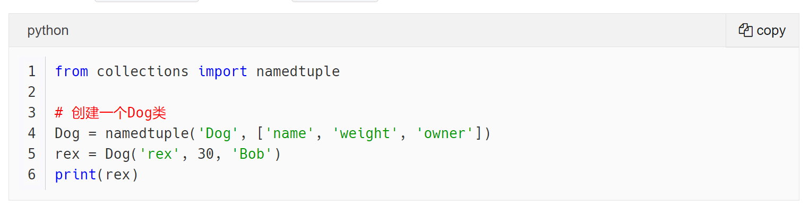

# 一个基于Jekyll的博客主题

[](https://github.com/Gaohaoyang/gaohaoyang.github.io/stargazers)
[](https://github.com/Gaohaoyang/gaohaoyang.github.io/network)
[](https://github.com/Gaohaoyang/gaohaoyang.github.io/issues)
[](https://github.com/Gaohaoyang/gaohaoyang.github.io/releases)
[](https://raw.githubusercontent.com/Gaohaoyang/gaohaoyang.github.io/master/LICENSE)

**博客访问地址：[https://www.jarvis73.com/](https://www.jarvis73.com/)**。若您喜欢这个博客主题，请给我个star以示鼓励吧，欢迎大家使用。

## 目录

* [预览图](#预览图)
* [各部分详情](#各部分详情)
    * [主页 Home](#主页-home)
    * [归档页 Archives](#归档页-archives)
    * [分类页 Categories](#分类页-categories)
    * [收藏页 Collections](#收藏页-collections)
    * [维基页 Wiki](#维基页-wiki)
    * [关于页 About](#关于页-about)
    * [移动端适配](#移动端适配)
    * [Footer](#footer)
* [博客主题使用方法](#博客主题使用方法)
    * [1. 安装 ruby 和 jekyll 环境](#1-安装-ruby-和-jekyll-环境)
    * [2. 复制博客主题代码](#2-复制博客主题代码)
    * [3. 修改参数](#3-修改参数)
        * [基本信息](#基本信息)
        * [链接信息](#链接信息)
        * [统计信息](#统计信息)
    * [4. 写文章](#4-写文章)
    * [5. 本地运行](#5-本地运行)
    * [6. 发布到 GitHub](#6-发布到-github)
* [License](#license)

## 预览图

先上预览图：

*   主页
    

*   文章页
    


## 各部分详情

### 主页 Home

主页默认展示5篇文章的摘要部分，用户点击标题或阅读全文后进入文章页。右侧为近期文章、分类、维基和外部区域四块区域，用户可以继续在这部分添加区域，只需修改`index.html`即可。

### 归档页 Archives

按照年份归档文章。

### 分类页 Categories

按照文章的分类，显示文章。

### 收藏页 Collections

本页可以收录一些常用的链接，采用了响应式的网格结构来组织链接，从而在移动端有更好的体验。

### 维基页 Wiki

本页显示 meta 标记为 Wiki_XXX 的文章, 详情见 [基本信息](#基本信息) .

### 关于页 About

对个人和对本站的介绍，使用`markdown`写的。

### 移动端适配

完美适配移动端。


### Footer

**欢迎使用这个主题，使用时请保留 footer 上的模板主题来源。** 主题支持 <a href="https://github.com/Gaohaoyang/gaohaoyang.github.io">HyG</a> & <a href="https://github.com/Jarvis73/jarvis73.github.io">Jarvis73</a> 


## 博客主题使用方法

欢迎使用这个主题，以下简单说一下使用方法。

### 1. 安装 ruby 和 jekyll 环境

这一步和第5步主要是为了让博客系统在本地跑起来，如果不想在本地运行，可以无视这两步，但我还是强烈建议试着先在本地跑起来，没有什么问题后再推送的 GitHub 上。

Windows 用户可以直接使用 [RubyInstaller](http://rubyinstaller.org/) 安装 ruby 环境。后续的操作中可能还会提示安装 DevKit，根据提示操作即可。

建议使用 [RubyGems 镜像- Ruby China](https://gems.ruby-china.org/) 安装 jekyll。

安装 jekyll 命令如下

```
gem install jekyll
```

详情可以查看 jekyll 官网。[https://jekyllrb.com/](https://jekyllrb.com/) 或 中文翻译版 jekyll 官网[http://jekyllcn.com/](http://jekyllcn.com/) （中文文档翻译落后于英文官网，有兴趣有时间的小伙伴可以参与翻译，为开源世界贡献一份力哦~）

在 mac OS X El Capitan 系统下安装可能会出现问题，解决方案详情见 jekyll 官网: [ https://jekyllrb.com/docs/troubleshooting/#jekyll-amp-mac-os-x-1011]( https://jekyllrb.com/docs/troubleshooting/#jekyll-amp-mac-os-x-1011)

对 jekyll 本身感兴趣的同学可以看看 jekyll 源码: [https://github.com/jekyll/jekyll](https://github.com/jekyll/jekyll)


### 2. 复制博客主题代码

可以直接 clone 下载或 fork 这个仓库的代码即可

### 3. 修改参数

主要修改 `_config.yml` 中的参数和自己的网站小图`favicon.ico`

`_config.yml`文件中

#### 基本信息

主要用于网站头部header。

```yml
# Site settings
title: Jarvis' Blog
brief-intro: 总有美丽的风景让人流连
baseurl: "" # the subpath of your site, e.g. /blog
url: "https://www.jarvis73.com" # the base hostname & protocol for your site
```

#### 链接信息

主要用于网站底部footer。

```yml
# other links
twitter_username: 
facebook_username: 
github_username:  jarvis73
email: zjw.cs@zju.edu.com
weibo_username: 
zhihu_username: lin-xi-1-1
linkedIn_username: 
dribbble_username:
```

#### 统计信息

获取 百度统计id 或 Google Analytics id 的方法：

访问 http://tongji.baidu.com/ 或 https://www.google.com/analytics/ 根据提示操作即可。当然，如果不想添加统计信息，这两个参数可以不填。

```yml
# statistic analysis 统计代码
# 百度统计 id，将统计代码替换为自己的百度统计id，即
# hm.src = "//hm.baidu.com/hm.js?xxxxxxxxxxxx";
# xxxxx字符串
baidu_tongji_id: cf8506e0ef223e57ff6239944e5d46a4
google_analytics_id: UA-72449510-4 # google 分析追踪id
```

成功后，进入自己的百度统计或 Google Analytics 后台管理，即可看到网站的访问量、访客等相关信息。

### 4. 写文章

#### 4.1 文档头

`_posts`目录下存放文章信息，文章头部注明 layout(布局)、title、date、categories、author(可选)、mathjax(可选，点击[这里](https://www.mathjax.org/)查看更多关于`Mathjax`)，如下：

```
---
layout: post
title: "训练 GAN 的理论分析和实践 (Wasserstein GAN)"
date: 2020-12-28 13:31:00 +0800
categories: Math 深度学习
mathjax: true
figure: /images/2020-12/WGAN-4.png
author: Jarvis
meta: Post	# 文章类型, 可选有 Post, Wiki_XXX
---
```

*   mathjax 设置为 true 时文章支持公式输入
*   figure 的路径指向摘要页要放的图片
*   meta 表示文章的类型. 标记为 Post 的文章为正式文章, 会在首页显示并正常归档; 标记为 Wiki_XXX 的会按照 XXX 来对文章进行分类并显示在 Wiki 页面. 注意 XXX 可选的项需要在 _config.yml 中的 `wiki_list` 列表中, 可以自行扩增该列表.

#### 4.2 文档目录

下面这两行代码为产生目录时使用

```
* content
{:toc}
```

#### 4.3 文档摘要

文章中存在的4次换行为摘要分割符，换行前的内容会以摘要的形式显示在主页Home上，进入文章页不影响。

换行符的设置见配置文件`_config.yml`的 excerpt，如下：

```yml
# excerpt
excerpt_separator: "\n\n\n\n"
```

#### 4.4 文档正文

使用 markdown 语法写文章。

#### 4.5 图片

*   可以使用markdown 语法直接插入图片 `` , 图片路径可以是互联网上的绝对网址, 也可以是基于项目根目录 `<project_path>` 的相对路径.

*   新增图片模板, 支持图片大小调整和图片标题显示

    `` 

    *   `class` 可选的预定义样式有 `polaroid`, `polaroid-small`, `polaroid-script`, `polaroid-script-less`, `polaroid-tiny` 五种图片大小, 依次分别为 原始图片大小的 95%, 75%, 60%, 50%, 40%. 
    *   `url` 为图片的路径, 图片路径可以使互联网上的绝对网址(http/https协议), 也可以是基于 `<project_path>/images/`  的相对路径.
    *   `title` 是图片的题注内容.

*   新增图片浮层, 点击图片可以放大显示.

#### 4.6 公式

设置文档头的 `mathjax: true` .

*   行内公式左右两侧要用`$$`来包住, 同时要保证`$$` 左右两边都有空格. 

    比如: `公式前 $$ a = b $$ 公式后` . 对于行间公式, 则需要左 `$$` 和右 `$$` 独立成行, 并且左 `$$` 的上一行和右 `$$` 的下一行都是空行. 

    比如: 

    ```
    公式前
    
    $$
    a = b
    $$
    
    公式后
    ```

#### 4.7 代码

代码风格与 GitHub 上 README 或 issue 中的一致。使用3个\`\`\`的方式。支持代码高亮，可以显示行号，代码类型，并支持一键复制。



#### 4.8 卡片

支持卡片模板 `` 

*   `type` 可以填入 `primary`, `danger`, `success`, `warning`, `info` 五种预定义类型, 也可以留空, 分别对应不同的提示信息. 
*   `title` 是卡片的标题信息 (可删除)
*   `content` 是卡片的第一部分主体内容
*   `tail` 是卡片的第二部分主体内容 (可删除)

`title, content, tail` 这三个属性支持 markdown 语法. 如果这几部分内容比较复杂, 需要写为多行, 可以采用 Liquid 的 `capture` 来实现:

````liquid


I am plain text.   
I am **Strong**.   
I am `code`.  
I am inline formula $$ \alpha $$ .

I am block formula:

$$
\mathcal{L} = \frac12(a - b)^2
$$

Block code:

```python
from functools import partial
```

List:
* 1
* 2



````

##### 卡片有什么用?

*   卡片可以用来显示基本, 警告, 成功, 危险, 重要等信息


*   卡片可以用来组织定理, 引理, 推论等数学内容.


#### 4.9 标题裁剪

首页右上角的 Recent Posts 模块中会显示最新的文章, 同时仅会在该模块中裁剪掉文章标题中**末尾的括号**以获得更好的观感.

比如: 标题 `奇异值分解 (SVD Decomposition)` 会被裁剪为 `奇异值分解` . 

### 5. 本地运行

本地执行

```
jekyll s
```

显示

```
Configuration file: E:/GitWorkSpace/blog/_config.yml
            Source: E:/GitWorkSpace/blog
       Destination: E:/GitWorkSpace/blog/_site
 Incremental build: disabled. Enable with --incremental
      Generating...
                    done in 6.33 seconds.
  Please add the following to your Gemfile to avoid polling for changes:
    gem 'wdm', '>= 0.1.0' if Gem.win_platform?
 Auto-regeneration: enabled for 'E:/GitWorkSpace/blog'
Configuration file: E:/GitWorkSpace/blog/_config.yml
    Server address: http://127.0.0.1:4000/
  Server running... press ctrl-c to stop.
```

在本地访问 localhost:4000 即可看到博客主页。

若安装了 Foxit 福昕pdf阅读器可能会占用4000端口，关闭 Foxit服务 或切换 jekyll 端口即可解决。详情见文章：[对这个 jekyll 博客主题的改版和重构](http://gaohaoyang.github.io/2016/03/12/jekyll-theme-version-2.0/)

若正在使用全局代理，可能会报错502，关闭全局代理即可。

### 6. 发布到 GitHub

没什么问题，推送到自己的博客仓库即可。

## License

[MIT License](https://github.com/Gaohaoyang/gaohaoyang.github.io/blob/master/LICENSE.md)
